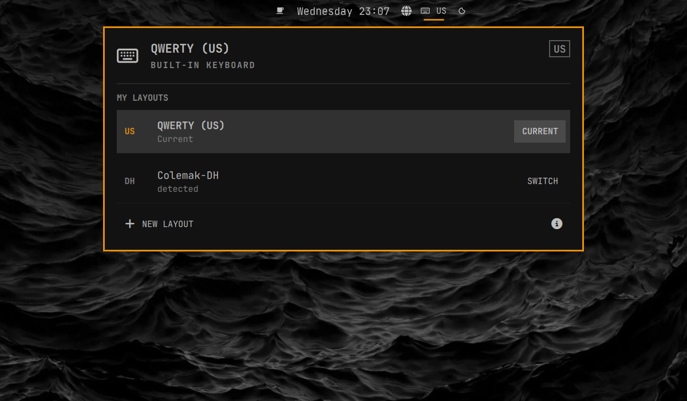

# Omakeyd

Omakeyd is an Omarchy bar plugin for switching keyboard layouts. It includes
QWERTY (US), Colemak-DH, and a simple editor for custom layouts.



## What it does

- Shows the active layout in the Omarchy bar.
- Opens a panel for switching layouts directly.
- Switches one physical keyboard at a time.
- Shows a keyboard selector when several keyboards are connected.
- Lets you create custom layouts by rearranging 30 letter and punctuation keys.

Omakeyd uses Hyprland's per-device keyboard settings and XKB. Switching is fast,
does not restart a service, and does not require root access.

## Requirements

- Omarchy Quattro
- Hyprland with Lua configuration support
- `xkbcli`

Omakeyd cannot run alongside
[keyd](https://github.com/rvaiya/keyd). keyd is a system service that remaps
keyboard input before it reaches Hyprland. If keyd is running, Omakeyd shows the
conflict and does not change the keyboard.

## Install

Install and enable Omakeyd with the standard Omarchy plugin command:

```bash
omarchy plugin add https://github.com/olivoil/omakeyd.git --enable
```

Omakeyd is placed on the right side of the bar by default. Omarchy prompts for
placement during installation, so you can choose another section.

If Omarchy's first-party keyboard-layout badge is also enabled, you can disable
it to avoid showing two layout indicators:

```bash
omarchy plugin disable omarchy.keyboard-layout
```

## Use

- Click the keyboard indicator to open the layout panel.
- Choose **Switch** beside a layout.
- Choose **New layout** to create a custom layout.
- Scroll or right-click the bar indicator to cycle layouts.
- If several keyboards are connected, select the keyboard at the top first.

QWERTY and Colemak-DH are built in and cannot be deleted. The included
Colemak-DH layout keeps Z on the physical Z key rather than applying the ISO
angle modification.

Omakeyd stores its settings and generated XKB symbols in:

```text
~/.config/omakeyd/config.json
~/.config/xkb/symbols/omakeyd_*
```

These are user-owned files. Omakeyd does not install a privileged helper,
PolicyKit rule, system service, or file under `/etc` or `/usr`.

## Remove

Remove Omakeyd with the standard Omarchy plugin command:

```bash
omarchy plugin remove io.github.olivoil.omakeyd
```

When the plugin is unloaded, it restores the per-keyboard XKB settings that
were active before Omakeyd first changed them.

The generated XKB files and saved layout definitions are harmless and remain in
your user configuration so a reinstall keeps your layouts. They can be removed
manually if you no longer want them.

## Upgrading from 0.2

Omakeyd 0.2 used keyd and installed a privileged helper after authentication.
Version 0.3 no longer uses that design. It migrates the saved Colemak-DH layout
name automatically, but keyd must be stopped or disabled before the new backend
can control the physical keyboard.

The old helper and PolicyKit action are not used by 0.3. Existing 0.2 users may
remove those two old files after confirming the new version works:

```bash
sudo rm -f /usr/local/libexec/omakeyd-helper
sudo rm -f /usr/share/polkit-1/actions/io.github.olivoil.omakeyd.policy
```

Do not remove an existing `/etc/keyd/*.conf` profile until you have confirmed
your layouts work without keyd; it may contain other remaps you still need.

## Command line

The backend prints JSON:

```bash
bin/omakeyd snapshot
bin/omakeyd apply --profile at-translated-set-2-keyboard --layout-id qwerty
bin/omakeyd apply --profile at-translated-set-2-keyboard --layout-id colemak-dh
bin/omakeyd doctor
```

## Development

Run the complete local check:

```bash
scripts/ci.sh
```

See [architecture](docs/architecture.md) and
[mapping model](docs/mapping-pipeline.md) for implementation details.
